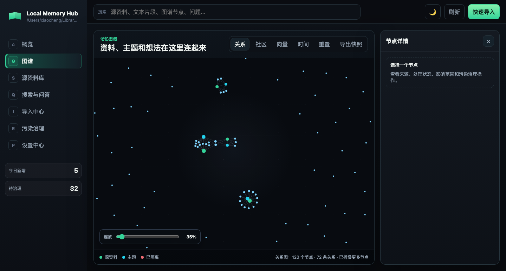
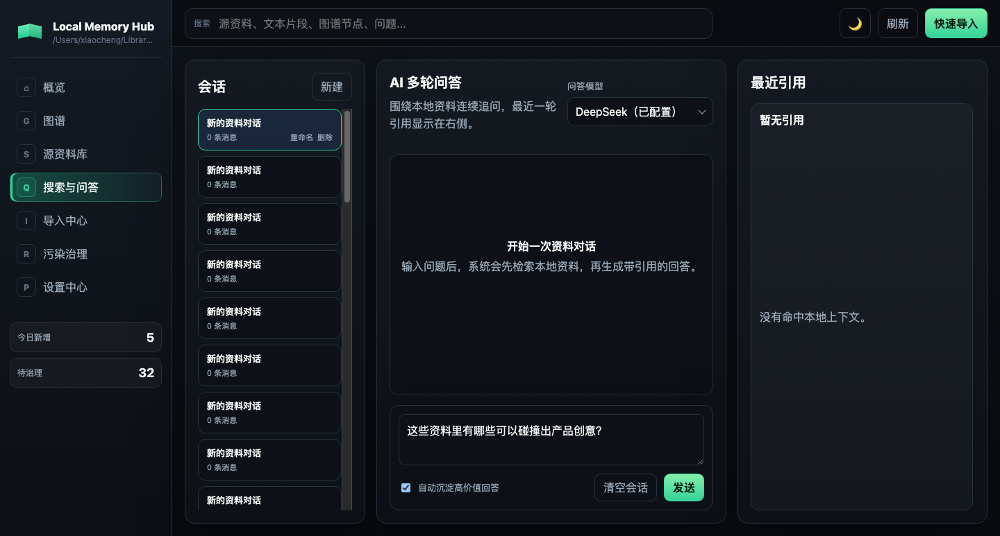
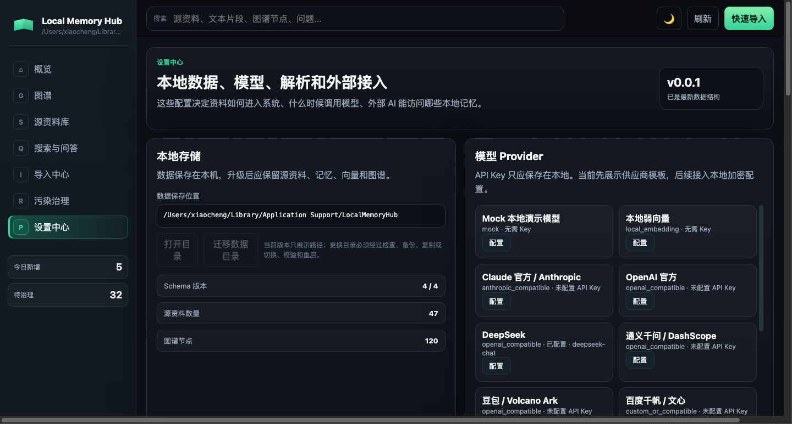

# Local Memory Hub

**本地优先的个人 AI 记忆层。** 把你散落各处的资料(文本、文件、网页、飞书 / 腾讯文档…)统一导入,在**本机**解析成可搜索、可追溯、可治理的「记忆」,再通过知识图谱、带引用的问答,以及 MCP 让 Codex / Claude / Cursor 等外部 AI 调用——**数据全程不出本机**。

> 核心理念:**源资料是你存的,记忆是 AI 能用的**。一条资料只有「进入记忆」(生成文本片段 + 向量索引 + 图谱节点)后,才会被搜索命中、被问答引用、在图谱里出现。

许可:[MIT](LICENSE) · 平台:macOS / Windows · 桌面壳:Tauri 2 · 运行时:Node + SQLite

---

## ⬇️ 下载(普通用户)

到 **[Releases 页](https://github.com/chengxiangkun/local-memory-hub/releases/latest)** 下载对应安装包,**双击即用**(内置运行时,无需安装 Node):

| 平台 | 安装包 | 首次打开 |
| --- | --- | --- |
| **macOS**(Apple 芯片) | `LocalMemoryHub_*_aarch64.dmg` | 右键 →「打开」(未签名,仅首次需要) |
| **Windows**(x64) | `*_x64-setup.exe` 或 `*_x64_en-US.msi` | SmartScreen →「更多信息」→「仍要运行」 |

> 安装包未做平台签名(开源项目,不强制证书),所以首次打开要手动放行一次,之后正常。
> 内含一键自动升级:发布新版后,App 启动会自动检测并升级(见[下文](#-自动升级))。

开发者也可从源码运行 / 自行打包,见 [从源码运行](#-从源码运行开发者) 与 [自行打包桌面应用](#-自行打包桌面应用)。

---

## 📸 截图

| 知识图谱 | 带引用问答 | 设置 / 模型 |
| --- | --- | --- |
|  |  |  |

---

## ✨ 特性

- 🗂️ **统一导入管线**:文本 / 文件 / 链接 / 外部文档走同一条流水线,先存源资料,再解析入记忆。
- 🧠 **本地优先解析 + 大模型兜底**:省 token / 平衡 / 深度三档;本地解析失败或置信度低时再调模型。
- 🔎 **向量 + 关键词 + 图谱联合检索**:语义召回 + 精确命中 + 一跳扩展;问答**带可点击 `[n]` 引用**,可追溯回源文件。
- 🕸️ **力导向知识图谱**:关系 / 社区 / 向量 / 时间四视图,缩放平移、节点详情、导出快照。
- 🧹 **污染治理**:标记污染 → 隔离(退出检索与问答)→ 恢复 / 彻底删除;全程治理审计。
- 🔌 **可拔插 embedding**:默认本地 `multilingual-e5-small`(免费离线),可换 e5-base/large、BGE-zh、或云端接口;离线自动回退轻量向量。
- 🤝 **外部文档接入**:飞书、腾讯文档,支持增量 / 修改 / 删除轮询同步;凭证可在界面**加密**配置。
- 🛰️ **外部 AI 调用(MCP)**:标准 stdio MCP 暴露只读工具 `memory.search / get_context / ask / graph.search`,以及**写入工具**(单条 / 批量导入、触发解析,**默认关闭**,需手动开启);逐工具开关 + 调用审计;隔离 / 删除内容不外泄。
- 🧩 **元数据增强**:每个源资料用大模型生成「摘要 + 关键词 + 能回答的问题」,问法与原文不一致也能召回。
- 🧷 **父文档召回**:命中任一片段即按顺序补齐整篇上下文,治「召回了对的文档却答错 / 碎片化」。
- 👍 **问答反馈闭环**:每条回答可 👍/👎,点踩填理由,沉淀 Bad Case 供迭代。
- 🩺 **知识库健康检查**:大模型扫全库,找矛盾 / 过时 / 缺失 / 孤立的内容。
- 🧠 **AI 概念卡**:为图谱概念节点生成概念描述 + 交叉引用。
- 💬 **飞书 IM 机器人**:在飞书私聊 / 群 @ 机器人提问,带本地记忆和引用回答(长连接,无需公网回调)。
- 🔗 **本地 Agent 桥接(免 API key)**:把本机 `codex` / Claude Code / OpenClaw 当问答 / 解析模型,复用本地订阅。
- 🔄 **软件内一键自动升级**(Tauri updater,签名校验)。
- 🎨 **深色 / 亮色双主题**,问答回答 **Markdown 渲染**,回车发送。
- 🔒 **本地与隐私**:数据存本机数据目录;API Key 与连接器凭证 **AES‑256‑GCM 加密**落盘,绝不进 Git。

---

## 🧭 核心闭环

```
导入(文本/文件/链接/飞书·腾讯)
      │
      ▼
源资料(原始文件 + 状态 + 可追溯)
      │  本地解析(失败→大模型兜底)
      ▼
记忆(文本片段 + 向量索引 + 图谱节点/关系 + 摘要)
      │
      ├── 图谱:探索关系
      ├── 搜索/问答:带 [n] 引用,可回溯源文件
      ├── 污染治理:隔离/删除不可信内容
      └── MCP:外部 AI(Codex/Claude/Cursor)调用本地记忆
```

---

## 🔄 自动升级

App 每次启动会后台检查更新源(GitHub Releases 的 `latest.json`):
- 若已发布**更高版本** → 自动下载该平台的**已签名**安装包 → 校验签名 → 安装 → 重启完成升级;
- 离线 / 同版本 / 失败 → 静默跳过,不影响使用。
- **升级不丢数据**:数据存在独立数据目录,升级只替换程序;涉及数据结构升级时**迁移前自动备份**。

---

## 🚀 从源码运行(开发者)

需要 Node.js 18+。

```bash
git clone https://github.com/chengxiangkun/local-memory-hub.git
cd local-memory-hub
npm install
npm start          # 启动 API(4317)+ Web(3100),浏览器开 http://127.0.0.1:3100
npm run stop       # 停止
```

> 首次是空库:进「图谱」点 **导入示例文本**,或在「导入中心」粘贴一段文本,即可看到它进入记忆、出现在图谱、被问答检索。

常用脚本:

| 命令 | 作用 |
| --- | --- |
| `npm start` / `npm run stop` | 启停本地服务 |
| `npm test` | 全量测试 |
| `npm run dev:mcp` | 启动 stdio MCP server |
| `npm run desktop` | 桌面应用开发态 |
| `npm run desktop:build` | 打包自包含桌面应用 |

---

## 📦 自行打包桌面应用

桌面应用是**自包含**的:`apps/desktop/stage-runtime.mjs` 在构建前把「当前平台的 node 二进制 + 工程 + 依赖」组装进 Tauri 资源,打出的安装包**脱离仓库 / 系统 Node 也能运行**。

```bash
npm run desktop:build
# 产物:apps/desktop/src-tauri/target/release/bundle/
#   macOS:  *.dmg / *.app
#   Windows: *.msi / *.exe(在 Windows 上构建)
```

需要 Rust 工具链(rustc/cargo)。跨平台发布由 GitHub Actions(`.github/workflows/release.yml`)在 macOS / Windows runner 上各自构建并发布到 Releases,详见 [`docs/DISTRIBUTION.md`](docs/DISTRIBUTION.md)。

> 体积约数百 MB(含本地向量依赖);e5 向量模型(~470MB)首次按需下载,离线回退轻量向量。

---

## 🔒 数据与隐私

- 数据目录:
  - macOS:`~/Library/Application Support/LocalMemoryHub`
  - 其它:`./.local-memory-data`
  - 可用 `LMH_DATA_DIR=/path` 覆盖。
- 源资料、记忆、向量、图谱、配置、加密凭证都存在该目录,**升级保留**。
- `.env.local`、`.secret-key`、加密凭证、本地数据均已 `.gitignore`,**不会进入 Git**。

---

## 🤖 模型配置

设置中心 →「模型 Provider」内置约 20 家供应商:**DeepSeek、Claude 官方 / Anthropic、OpenAI、通义千问 / DashScope、智谱 GLM、Moonshot / Kimi、豆包 / Volcano、百度文心、MiniMax、腾讯混元、讯飞星火、OpenRouter、Google Gemini、硅基流动、零一万物、xAI Grok、Groq、Ollama** 等。

- 填 Base URL / 模型 / API Key 即可;模型名是**可输入下拉**(列常见模型,也支持自定义)。
- API Key **仅加密保存在本地**。
- 问答默认选**已配置的模型**,并记住你上次的选择。
- 也可在 `.env.local` 配置,示例见 [`.env.example`](.env.example)。

---

## 🤝 外部文档接入(飞书 / 腾讯文档)

「导入中心 → 外部文档」连接。App 凭证可在卡片的 **「凭证配置」** 里**加密填写**(无需手改 `.env.local`、保存即生效),也可继续用 `.env.local`。支持增量 / 修改 / 删除轮询同步,已做节流 + 未变跳过以省调用额度。

---

## 🛰️ 外部 AI 调用(MCP)

```bash
npm run dev:mcp   # apps/mcp/src/mcp-stdio.js
```

在 Claude Desktop / Cursor / Codex 的 MCP 配置中指向 `apps/mcp/src/mcp-stdio.js`(设置页有可复制的接入示例)。可逐工具开关,每次调用有审计;**隔离 / 删除的内容不会外泄**。

---

## 🗂️ 目录结构

```text
apps/api/      本地 API:导入、解析、记忆、图谱、向量、模型 Provider、连接器
apps/web/      Web UI(图谱首页、源资料库、搜索问答、污染治理、导入中心、设置中心)
apps/mcp/      MCP(stdio + 兼容 HTTP)
apps/desktop/  Tauri 桌面壳(自包含运行时 + 自动升级)
docs/          PRD、架构、路线图、分发说明、使用帮助
.github/       发布流水线(GitHub Actions)
```

---

## 🧪 测试

```bash
npm test    # 全量测试组(导入/解析/检索/向量/治理/迁移/会话/连接器/MCP 等)
```

---

## 🗺️ 路线图

- ✅ 已完成:统一导入、本地解析 + 兜底、向量 + 图谱检索、带引用问答、污染治理、可拔插 embedding、飞书 / 腾讯接入、MCP(只读 + 写入)、自包含桌面应用(Mac/Windows)、一键自动升级。
- ✅ 检索 / 理解增强:元数据增强、父文档召回、问答反馈闭环、知识库健康检查、AI 概念卡。
- ✅ 接入扩展:飞书 IM 机器人、本地 Agent 桥接(codex / Claude Code / OpenClaw 当模型)、外部 agent 批量 / 单条写入。
- ⏳ 进行中 / 后续:Intel Mac 构建、文档内嵌图片 / 飞书图片提取、表格 / 结构化数据专用检索、有道云(无公开 API,客观受限)。

详见 [`docs/`](docs/)。

---

## 🙋 FAQ

- **首次打开提示「已损坏 / 无法验证开发者」?** 未签名所致。macOS 右键→「打开」或 `xattr -dr com.apple.quarantine <App>`;Windows SmartScreen「仍要运行」。
- **升级会丢数据吗?** 不会。数据在独立目录,升级只换程序;结构升级前自动备份。
- **必须联网吗?** 否。本地解析 / 检索 / 问答(本地/兜底)可离线;仅云端模型、外部文档同步、首次下载向量模型需要网络。
- **数据会上传吗?** 否。除非你主动调用云端模型或同步外部文档,数据不出本机。

---

## 🤝 贡献

欢迎 Issue / PR。改动请确保 `npm test` 通过;UI 改动请附前后说明或截图。

## 许可

[MIT License](LICENSE) — 可自由使用、修改、分发,需保留版权与许可声明。
